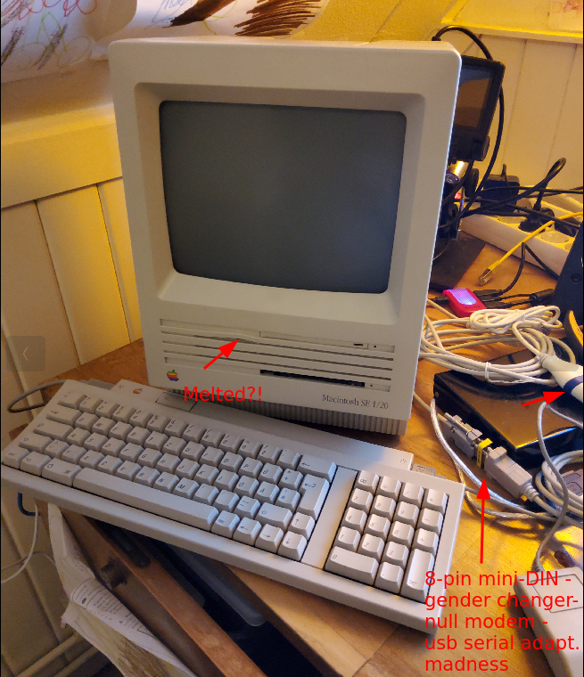

# AoC2022
My take on the [Advent of Code 2022](https://adventofcode.com/2022). I wrote it _entirely_ on a 
[Mac SE](https://en.wikipedia.org/wiki/Macintosh_SE), using 
[Symantec THINK Pascal 4.0](https://www.macintoshrepository.org/1758-symantec-think-pascal-4-0).

## Why?

Because I love my 1988 [Mac SE](https://en.wikipedia.org/wiki/Macintosh_SE) 1/20. It's upgraded to its max of 4 Mb of
working memory, and it has been retrofitted with a BlueSCSI SD card, but this component isn't required for its purpose
as a AoC dev machine. It _did_ help in transferring the Symantec THINK Pascal 4.0 binaries, though.

Although Standard Pascal feels a little dated, it still is extremely usable. You also get a few very nice features,
(which require enabling): null pointer checking and range checking. Beat that, C/C++! It's always time- and brain-
consuming to learn a new programming language, but AoC is kinda ideal for this and Pascal is, thus far, my favorite
"ancient" programming language, which also happens to be supported for a wide range of vintage computer systems I have
in my collection, most of which are from the late 1980's to early 1990's.

As a retrocomputing enthusiast and having participated in previous years of AoC, I wanted to try my hand at doing AoC
2022 using one of my vintage machines. I chose the Mac SE for its usability and simply because it's as cute as a button.
Just look at it!

